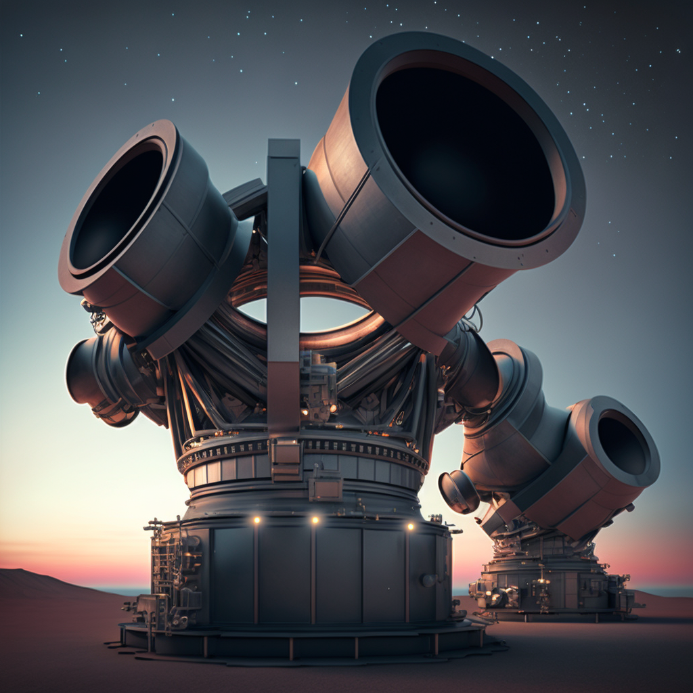

## Black hole:

A region of spacetime from which nothing, not even light, can escape

---

# Types of black holes

- Stellar black holes: Formed from the collapse of a star with a mass greater than about 3 times the mass of the Sun
- Intermediate-mass black holes: Black holes with masses in the range of 100 to 100,000 solar masses, believed to be formed through the merger of smaller black holes or the collapse of very massive stars
- Supermassive black holes: Black holes with masses millions or billions of times the mass of the Sun, found at the centers of most galaxies

---

# Formation of black holes

- Stellar black holes: When a star runs out of nuclear fuel, it collapses under its own gravity and forms a black hole if its mass is greater than about 3 solar masses
- Supermassive black holes: The exact mechanism of supermassive black hole formation is not fully understood, but they may be formed through the merger and accretion of smaller black holes, or through the collapse of very massive clouds of gas and dust

---

# Properties of black holes

- Mass and size: Black holes have a very small size compared to their mass, with the Schwarzschild radius (the distance from the center of the black hole to the event horizon) being proportional to the mass of the black hole: $r_S = 2GM/c^2$, where `G` is the gravitational constant, `M` is the mass of the black hole, and `c` is the speed of light

---

- Event horizon: The boundary around a black hole beyond which no information or matter can escape
- Schwarzschild radius: The distance from the center of the black hole to the event horizon, named after physicist Karl Schwarzschild who first calculated it: $r_S = 2GM/c^2$, where `G` is the gravitational constant, `M` is the mass of the black hole, and `c` is the speed of light

---

# Effects of black holes

- Gravitational time dilation: The phenomenon of time passing slower in strong gravitational fields, such as near a black hole: $t = t_0\sqrt{1-r_S/r}$, where `t` is the time experienced by an observer at a distance `r` from the black hole, $t_0$ is the time experienced by a distant observer, and $r_S$ is the Schwarzschild radius
  

---

- Accretion discs: The ring of material (such as gas and dust) that forms around a black hole and is pulled inward by its gravity, releasing energy as it falls towards the event horizon
- Jet formation: The emission of high-energy particles in the form of narrow jets from the poles of a black hole, likely powered by the rotation and magnetic fields of the black hole
  

---

# Observation of black holes

- Early indirect observations: Evidence for the existence of black holes was initially inferred through the observation of their effects on nearby objects, such as the orbits of stars around the center of a galaxy
- The Event Horizon Telescope collaboration captured the first direct image of a black hole in 2019, using a network of telescopes to observe the supermassive black hole at the center of the galaxy M87
  

---

# Black holes in popular culture

- Black holes have been featured in numerous science fiction stories and films, often as a means of interstellar travel or as a threat to humanity
  

---

- "Interstellar": A team of astronauts travel through a wormhole and encounter a supermassive black hole.
- "Event Horizon": A rescue crew investigates the disappearance of a spaceship and discovers that it encountered a black hole and has been taken over by an otherworldly force.
- "The Black Hole": A spaceship is drawn into a black hole and embarks on a journey through a strange alternate universe.

"Star Trek", "Doctor Who", "Babylon 5", others...

---

- Misconceptions about black holes: Despite their scientific basis, black holes have also been the subject of many myths and misconceptions in popular culture

---

- Black holes suck everything in: Black holes do not "suck" everything in, but objects are attracted to them due to their gravity.
- Black holes are "holes" in space: Black holes are regions of spacetime with strong gravitational fields, not physical "holes."
- Black holes are infinitely dense: Black hole density depends on its mass and size, and is not infinite.
- Black holes destroy everything they touch: Black holes can have dramatic effects on nearby objects, but do not destroy everything they touch.

---

# Future research on black holes

- Study of black hole mergers and gravitational waves: The detection of gravitational waves emitted by the merger of two black holes has opened up new avenues of research into the properties and behavior of black holes

---

- Search for intermediate-mass black holes: The existence of intermediate-mass black holes remains unconfirmed, but their discovery could shed light on the formation and evolution of black holes
- The study of the behavior of matter and energy near the event horizon of a black hole could provide insights into the fundamental nature of spacetime and the laws of physics

---

# Black holes in the broader context of physics

- Black holes play a crucial role in the evolution of galaxies, influencing the formation and movement of stars and shaping the structure of galactic cores

---

- The study of black holes has led to important discoveries and insights in the fields of general relativity and quantum mechanics, and continues to be a rich area of research at the intersection of these theories

---

# Conclusion

- Black holes are objects with extremely strong gravitational fields, formed through the collapse of massive objects or the merger of smaller black holes.

- Future directions for black hole research: The detection of gravitational waves and the first direct image of a black hole have opened up new opportunities for research, and the study of black holes will continue to be an active field of inquiry in the coming years.

